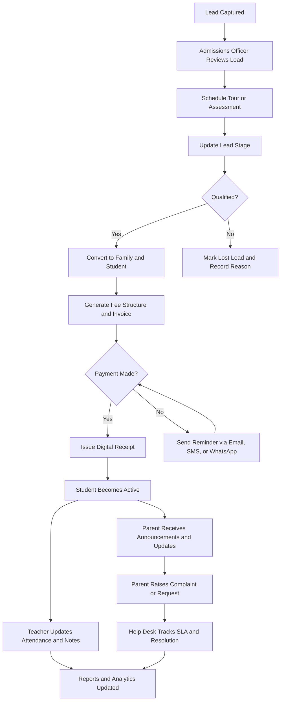

## 1. Product Overview
EduDrive CRM is a multi-tenant school operations and parent engagement platform for private Nursery, Primary, and Secondary schools in Nigeria. It centralizes admissions, student lifecycle management, fee collection, communication, support, staff monitoring, and reporting in one system.

- The product solves fragmented school administration, weak parent follow-up, poor fee visibility, and limited operational reporting for school owners and administrators.
- Its market value is in helping schools increase enrollment conversion, improve fee recovery, reduce admin overhead, and provide a more professional parent experience.

## 2. Core Features

### 2.1 User Roles
| Role | Registration Method | Core Permissions |
|------|---------------------|------------------|
| Super Admin | Invited by platform owner | Manage schools, subscriptions, billing settings, system-wide configuration, and high-level analytics |
| School Admin | Invited by Super Admin or school owner | Configure school branding, terms, classes, users, fee setup, and operational settings |
| Admissions Officer | Invited by School Admin | Capture leads, manage pipeline, schedule tours and assessments, track follow-ups, and convert leads to students |
| Bursar | Invited by School Admin | Configure fee structures, issue invoices, record payments, generate receipts, and monitor debtors |
| Teacher | Invited by School Admin | Mark attendance, add academic and behaviour notes, view assigned students, and communicate with parents |
| Help Desk Officer | Invited by School Admin | Manage tickets, assign complaints, track SLA deadlines, and record resolutions |
| Parent User | Created from family profile or invited | View child information, invoices, payment history, announcements, and communication history |

### 2.2 Feature Module
1. **Authentication**: login, logout, password reset, refresh token handling, email verification, and role-aware session management.
2. **Executive Dashboard**: revenue summary, outstanding fees, active admissions, ticket counts, student population, and recent activity.
3. **Admissions Workspace**: lead capture, Kanban pipeline, list view, scheduling, reminders, assessments, lost lead reasons, and conversion workflows.
4. **Families and Students**: household grouping, parent and guardian profiles, student records, emergency contacts, medical information, class assignment, and lifecycle history.
5. **Finance Operations**: fee structures, invoices, online and offline payments, receipts, debtor tracking, reminder scheduling, and finance reports.
6. **Messaging Hub**: email, WhatsApp, SMS, announcements, templates, and delivery logs.
7. **Help Desk**: parent complaints, internal ticket routing, SLA monitoring, status tracking, and resolution analytics.
8. **Staff Operations**: role-based permissions, attendance tracking, activity logs, performance metrics, and audit trail visibility.
9. **Reports and Analytics**: admissions funnel, fee collection, student statistics, attendance trends, parent engagement, and staff performance reports.
10. **School Settings**: branding, communication settings, payment settings, term/session setup, class structure, and user administration.

### 2.3 Page Details
| Page Name | Module Name | Feature Description |
|-----------|-------------|---------------------|
| Login / Auth | Sign in | Email and password login, remember session, password reset, role-aware redirect, device/session security feedback |
| Login / Auth | Password recovery | Reset request, email delivery, secure token validation, new password submission |
| Dashboard | KPI overview | Revenue cards, outstanding balance, active leads, open tickets, student count, quick actions |
| Dashboard | Operational feed | Recent payments, new leads, overdue invoices, unresolved tickets, staff activity |
| Admissions | Lead inbox | Manual lead creation, source tagging, duplicate checks, filters, search |
| Admissions | Kanban pipeline | Drag-and-drop stages, stage counts, probability indicators, reminder badges |
| Admissions | Schedule center | Tour booking, assessment scheduling, follow-up calendar, reminder automation |
| Admissions | Conversion flow | Lead qualification, assessment outcome, enrollment approval, student profile creation |
| Families | Household overview | Family grouping, guardians, siblings, billing contact, household notes |
| Students | Student profile | Bio data, admission history, class assignment, medical data, behaviour, academic record, documents |
| Parents | Parent profile | Contact details, linked students, communication history, payment responsibility, preferred channel |
| Finance | Fee structure manager | Term-based fees, class-specific fees, optional charges, discounts, and due date rules |
| Finance | Invoices and receipts | Invoice creation, bulk billing, payment recording, online verification, digital receipts |
| Finance | Debtors dashboard | Aging buckets, debtor ranking, reminder queue, collection status, reconciliation flags |
| Messaging | Templates | Reusable message templates for welcome, reminders, announcements, and support updates |
| Messaging | Broadcast center | Segment by class, debtor status, admissions stage, or parent group and send through selected channels |
| Help Desk | Ticket board | Complaint creation, assignment, priority, SLA timer, internal notes, resolution status |
| Staff | Staff dashboard | Attendance summary, activity logs, workload indicators, and performance scorecards |
| Reports | Analytics workspace | Filterable reports, export support, date ranges, module-level charts, and school-wide trends |
| Settings | School setup | Branding, academic session setup, class/arm configuration, payment provider keys, communication configuration |

## 3. Core Process
The main operational flow begins with a lead entering the system from a form, referral, or staff entry. Admissions officers qualify and nurture the lead through visits, assessments, and reminders. Once approved, the lead is converted into a family and student record, after which finance generates invoices and tracks payments. Parents receive announcements, reminders, and support responses across email, SMS, and WhatsApp. School leaders monitor all activity from dashboards, reports, and audit logs.

## 4. User Interface Design
### 4.1 Design Style
- A confident editorial operations console with a polished Nigerian private-school business feel: dark ink surfaces, warm paper panels, and high-contrast status accents.
- Primary colors: deep indigo `#14213D`, emerald `#0B8F6A`, gold `#D9A441`, soft paper `#F6F1E8`, and alert red `#C94B4B`.
- Button style: rounded rectangular controls with crisp borders, layered shadows, and strong hover transitions that feel deliberate and premium.
- Font direction: a distinctive serif for large section titles paired with a readable humanist sans-serif for UI controls, tables, and forms.
- Layout style: desktop-first split panels, analytics cards, sticky sub-navigation, dense but breathable data tables, and modular drawers for record editing.
- Icon style: clean line icons with occasional high-contrast badges for finance, admissions, communication, and risk states.

### 4.2 Page Design Overview
| Page Name | Module Name | UI Elements |
|-----------|-------------|-------------|
| Login / Auth | Sign in | Brand panel, trust messaging, school illustration, compact form, status feedback, reset links |
| Dashboard | KPI overview | Layered metric cards, revenue trend chart, outstanding fee table, quick action rail |
| Admissions | Kanban pipeline | Drag cards, stage headers, sticky filters, activity drawer, reminder chips, motion transitions |
| Families / Students | Profile workspace | Tabbed detail panels, household sidebar, timeline history, medical alerts, document drawers |
| Finance | Billing workspace | Invoice tables, overdue charts, payment modal, receipt preview, status timeline |
| Messaging | Broadcast center | Template cards, audience filters, send preview, delivery status list, channel toggles |
| Help Desk | Ticket board | Priority colors, SLA timers, assignment controls, threaded notes, analytics summary |
| Reports | Analytics workspace | Filter toolbar, export buttons, chart grid, comparison cards, summary narrative blocks |
| Settings | Configuration | Form sections, provider key panels, school branding uploader, role matrix tables |

### 4.3 Responsiveness
The product follows a desktop-first approach because most school administrative workflows happen on office desktops and laptops. Tablet and mobile adaptations should preserve access to essential actions, collapse dense tables into card stacks where needed, and support touch interactions for admissions and support workflows.

### 4.4 3D Scene Guidance
Not applicable for the MVP. The product should rely on premium 2D interface design, data visualization, and motion rather than 3D scenes.
