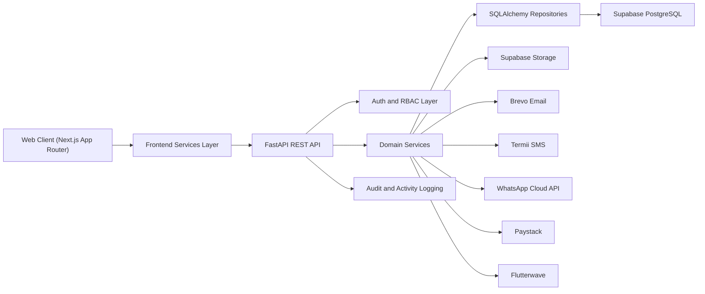
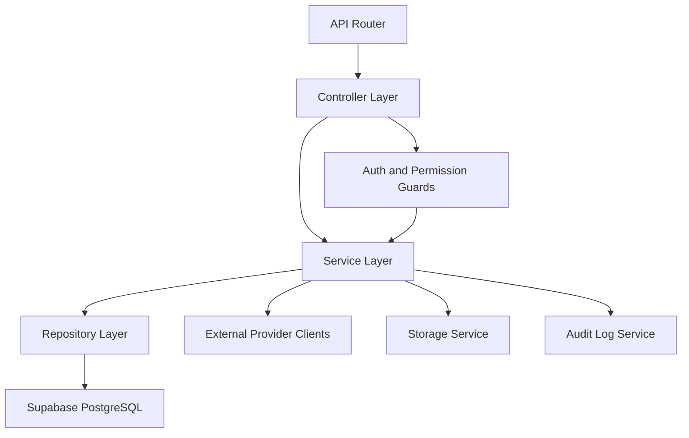
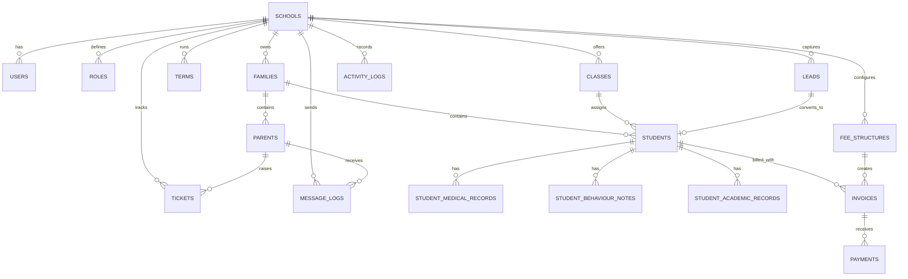

## 1. Architecture Design
EduDrive CRM uses a multi-tenant web architecture with a Next.js frontend, a FastAPI backend, Supabase PostgreSQL for relational storage, Supabase Storage for files, and external integrations for email, SMS, WhatsApp, and payments. Tenant isolation is enforced through `school_id` across domain entities, backend authorization checks, and school-scoped queries.



## 2. Technology Description
- Frontend: Next.js 15 + React 19 + TypeScript + Tailwind CSS + shadcn/ui + TanStack Query + React Hook Form + Zod + Framer Motion
- Frontend state strategy: server state in TanStack Query, form state in React Hook Form, local UI state in React hooks, authenticated session persisted via secure HTTP-only token strategy where possible
- Backend: FastAPI + Pydantic + SQLAlchemy 2.x + Alembic
- Authentication: JWT access tokens + refresh tokens + bcrypt password hashing + role and permission guards
- Database: Supabase PostgreSQL as primary relational database
- Storage: Supabase Storage for logos, receipts, admission documents, and attachments
- Messaging and email: Brevo, Termii SMS API, WhatsApp Cloud API
- Payments: Paystack and Flutterwave with webhook verification
- Hosting: Vercel for frontend, Render for backend

## 3. Route Definitions
| Route | Purpose |
|-------|---------|
| `/` | Marketing-aware sign-in landing page with product framing and login form |
| `/login` | Dedicated authentication screen |
| `/forgot-password` | Password reset request |
| `/reset-password` | Password reset completion |
| `/dashboard` | School-level executive dashboard |
| `/admissions` | Admissions pipeline overview with Kanban and list views |
| `/admissions/calendar` | Tours, assessments, and follow-up scheduling |
| `/admissions/leads/[leadId]` | Lead detail and conversion workspace |
| `/families` | Household directory and family management |
| `/families/[familyId]` | Family detail workspace |
| `/students` | Student directory, filters, and bulk actions |
| `/students/[studentId]` | Student profile, records, medical, behaviour, and documents |
| `/parents` | Parent/guardian directory |
| `/parents/[parentId]` | Parent detail and communication history |
| `/finance` | Finance overview dashboard |
| `/finance/fee-structures` | Fee setup and class-based charge management |
| `/finance/invoices` | Invoice creation and management |
| `/finance/payments` | Payment records, reconciliation, and receipts |
| `/finance/debtors` | Outstanding balance and collection tracking |
| `/messaging` | Messaging overview and delivery analytics |
| `/messaging/templates` | Template management |
| `/messaging/broadcasts` | Broadcast creation and audience segmentation |
| `/helpdesk` | Ticket board and complaint management |
| `/staff` | Staff dashboard, activity, and attendance monitoring |
| `/reports` | Cross-module reporting and export center |
| `/settings` | School configuration, branding, integrations, payment settings, and users |

## 4. API Definitions

### 4.1 Authentication
```ts
type LoginRequest = {
  email: string;
  password: string;
};

type TokenResponse = {
  access_token: string;
  refresh_token: string;
  token_type: "bearer";
  expires_in: number;
  user: {
    id: string;
    schoolId: string;
    role: "super_admin" | "school_admin" | "admissions_officer" | "bursar" | "teacher" | "helpdesk_officer" | "parent";
    fullName: string;
    email: string;
  };
};
```

### 4.2 Admissions
```ts
type Lead = {
  id: string;
  schoolId: string;
  firstName: string;
  lastName: string;
  parentName: string;
  parentPhone?: string;
  parentEmail?: string;
  source: "website" | "walk_in" | "referral" | "social_media" | "campaign" | "manual";
  stage: "new" | "contacted" | "tour_scheduled" | "assessment_booked" | "offered" | "enrolled" | "lost";
  interestedClass?: string;
  followUpAt?: string;
  lostReason?: string;
  createdAt: string;
};

type ConvertLeadRequest = {
  leadId: string;
  family: {
    householdName: string;
    primaryContactParentId?: string;
  };
  student: {
    firstName: string;
    lastName: string;
    gender?: string;
    dateOfBirth?: string;
    classId?: string;
  };
};
```

### 4.3 Finance
```ts
type Invoice = {
  id: string;
  schoolId: string;
  studentId: string;
  termId: string;
  status: "draft" | "issued" | "part_paid" | "paid" | "overdue" | "cancelled";
  amountDue: number;
  amountPaid: number;
  dueDate: string;
  issuedAt?: string;
};

type RecordPaymentRequest = {
  invoiceId: string;
  amount: number;
  method: "cash" | "bank_transfer" | "pos" | "paystack" | "flutterwave";
  reference?: string;
  paidAt: string;
};
```

### 4.4 Help Desk
```ts
type Ticket = {
  id: string;
  schoolId: string;
  familyId?: string;
  parentId?: string;
  subject: string;
  channel: "portal" | "email" | "sms" | "whatsapp" | "internal";
  priority: "low" | "medium" | "high" | "urgent";
  status: "open" | "assigned" | "in_progress" | "resolved" | "closed";
  assigneeId?: string;
  slaDueAt?: string;
  createdAt: string;
};
```

### 4.5 Core REST Endpoints
| Method | Endpoint | Purpose |
|--------|----------|---------|
| `POST` | `/api/v1/auth/login` | Authenticate user and return tokens |
| `POST` | `/api/v1/auth/refresh` | Issue new access token from refresh token |
| `POST` | `/api/v1/auth/forgot-password` | Start password reset flow |
| `GET` | `/api/v1/dashboard/summary` | Return dashboard KPIs for current school |
| `GET` | `/api/v1/leads` | List leads with filtering and pagination |
| `POST` | `/api/v1/leads` | Create lead |
| `PATCH` | `/api/v1/leads/{lead_id}` | Update lead details or stage |
| `POST` | `/api/v1/leads/{lead_id}/convert` | Convert lead into family and student records |
| `GET` | `/api/v1/families` | List households |
| `GET` | `/api/v1/students` | List students |
| `GET` | `/api/v1/parents` | List parents |
| `GET` | `/api/v1/fee-structures` | List fee structures |
| `POST` | `/api/v1/invoices` | Create invoice |
| `POST` | `/api/v1/payments` | Record payment |
| `POST` | `/api/v1/payments/paystack/initialize` | Initialize Paystack transaction |
| `POST` | `/api/v1/payments/flutterwave/initialize` | Initialize Flutterwave transaction |
| `POST` | `/api/v1/webhooks/paystack` | Handle Paystack webhook |
| `POST` | `/api/v1/webhooks/flutterwave` | Handle Flutterwave webhook |
| `POST` | `/api/v1/messages/broadcast` | Send segmented broadcast |
| `GET` | `/api/v1/tickets` | List help desk tickets |
| `POST` | `/api/v1/tickets` | Create complaint ticket |
| `PATCH` | `/api/v1/tickets/{ticket_id}` | Update ticket assignment or status |
| `GET` | `/api/v1/reports/{report_name}` | Return scoped report dataset |

## 5. Server Architecture Diagram


## 6. Data Model

### 6.1 Data Model Definition


### 6.2 Data Definition Language
```sql
CREATE TABLE schools (
    id UUID PRIMARY KEY,
    name VARCHAR(160) NOT NULL,
    slug VARCHAR(160) UNIQUE NOT NULL,
    school_type VARCHAR(40),
    logo_url TEXT,
    primary_color VARCHAR(20),
    created_at TIMESTAMPTZ DEFAULT NOW()
);

CREATE TABLE roles (
    id UUID PRIMARY KEY,
    school_id UUID NOT NULL REFERENCES schools(id) ON DELETE CASCADE,
    name VARCHAR(60) NOT NULL,
    permissions JSONB NOT NULL DEFAULT '[]'::jsonb,
    created_at TIMESTAMPTZ DEFAULT NOW(),
    UNIQUE (school_id, name)
);

CREATE TABLE users (
    id UUID PRIMARY KEY,
    school_id UUID NOT NULL REFERENCES schools(id) ON DELETE CASCADE,
    role_id UUID REFERENCES roles(id),
    full_name VARCHAR(160) NOT NULL,
    email VARCHAR(190) NOT NULL,
    password_hash TEXT NOT NULL,
    status VARCHAR(30) NOT NULL DEFAULT 'active',
    last_login_at TIMESTAMPTZ,
    created_at TIMESTAMPTZ DEFAULT NOW(),
    UNIQUE (school_id, email)
);

CREATE TABLE families (
    id UUID PRIMARY KEY,
    school_id UUID NOT NULL REFERENCES schools(id) ON DELETE CASCADE,
    household_name VARCHAR(160) NOT NULL,
    billing_contact_parent_id UUID,
    notes TEXT,
    created_at TIMESTAMPTZ DEFAULT NOW()
);

CREATE TABLE parents (
    id UUID PRIMARY KEY,
    school_id UUID NOT NULL REFERENCES schools(id) ON DELETE CASCADE,
    family_id UUID NOT NULL REFERENCES families(id) ON DELETE CASCADE,
    full_name VARCHAR(160) NOT NULL,
    email VARCHAR(190),
    phone VARCHAR(40),
    relationship VARCHAR(40),
    preferred_channel VARCHAR(30) DEFAULT 'email',
    created_at TIMESTAMPTZ DEFAULT NOW()
);

CREATE TABLE classes (
    id UUID PRIMARY KEY,
    school_id UUID NOT NULL REFERENCES schools(id) ON DELETE CASCADE,
    name VARCHAR(120) NOT NULL,
    arm VARCHAR(50),
    level_group VARCHAR(50),
    created_at TIMESTAMPTZ DEFAULT NOW()
);

CREATE TABLE students (
    id UUID PRIMARY KEY,
    school_id UUID NOT NULL REFERENCES schools(id) ON DELETE CASCADE,
    family_id UUID NOT NULL REFERENCES families(id) ON DELETE CASCADE,
    class_id UUID REFERENCES classes(id),
    lead_id UUID,
    admission_no VARCHAR(80),
    first_name VARCHAR(120) NOT NULL,
    last_name VARCHAR(120) NOT NULL,
    gender VARCHAR(20),
    date_of_birth DATE,
    status VARCHAR(30) NOT NULL DEFAULT 'active',
    created_at TIMESTAMPTZ DEFAULT NOW()
);

CREATE TABLE leads (
    id UUID PRIMARY KEY,
    school_id UUID NOT NULL REFERENCES schools(id) ON DELETE CASCADE,
    first_name VARCHAR(120) NOT NULL,
    last_name VARCHAR(120) NOT NULL,
    parent_name VARCHAR(160),
    parent_phone VARCHAR(40),
    parent_email VARCHAR(190),
    source VARCHAR(40) NOT NULL,
    stage VARCHAR(40) NOT NULL,
    interested_class VARCHAR(120),
    follow_up_at TIMESTAMPTZ,
    lost_reason TEXT,
    created_at TIMESTAMPTZ DEFAULT NOW()
);

CREATE TABLE fee_structures (
    id UUID PRIMARY KEY,
    school_id UUID NOT NULL REFERENCES schools(id) ON DELETE CASCADE,
    class_id UUID REFERENCES classes(id),
    term_name VARCHAR(80) NOT NULL,
    title VARCHAR(160) NOT NULL,
    amount NUMERIC(12,2) NOT NULL,
    due_days INTEGER,
    created_at TIMESTAMPTZ DEFAULT NOW()
);

CREATE TABLE invoices (
    id UUID PRIMARY KEY,
    school_id UUID NOT NULL REFERENCES schools(id) ON DELETE CASCADE,
    student_id UUID NOT NULL REFERENCES students(id) ON DELETE CASCADE,
    fee_structure_id UUID REFERENCES fee_structures(id),
    invoice_number VARCHAR(80) NOT NULL,
    status VARCHAR(30) NOT NULL DEFAULT 'draft',
    amount_due NUMERIC(12,2) NOT NULL,
    amount_paid NUMERIC(12,2) NOT NULL DEFAULT 0,
    due_date DATE NOT NULL,
    issued_at TIMESTAMPTZ,
    created_at TIMESTAMPTZ DEFAULT NOW(),
    UNIQUE (school_id, invoice_number)
);

CREATE TABLE payments (
    id UUID PRIMARY KEY,
    school_id UUID NOT NULL REFERENCES schools(id) ON DELETE CASCADE,
    invoice_id UUID NOT NULL REFERENCES invoices(id) ON DELETE CASCADE,
    amount NUMERIC(12,2) NOT NULL,
    method VARCHAR(40) NOT NULL,
    provider_reference VARCHAR(190),
    paid_at TIMESTAMPTZ NOT NULL,
    created_at TIMESTAMPTZ DEFAULT NOW()
);

CREATE TABLE tickets (
    id UUID PRIMARY KEY,
    school_id UUID NOT NULL REFERENCES schools(id) ON DELETE CASCADE,
    parent_id UUID REFERENCES parents(id),
    family_id UUID REFERENCES families(id),
    subject VARCHAR(200) NOT NULL,
    description TEXT,
    priority VARCHAR(20) NOT NULL DEFAULT 'medium',
    status VARCHAR(30) NOT NULL DEFAULT 'open',
    assignee_user_id UUID REFERENCES users(id),
    sla_due_at TIMESTAMPTZ,
    created_at TIMESTAMPTZ DEFAULT NOW()
);

CREATE TABLE message_logs (
    id UUID PRIMARY KEY,
    school_id UUID NOT NULL REFERENCES schools(id) ON DELETE CASCADE,
    parent_id UUID REFERENCES parents(id),
    channel VARCHAR(20) NOT NULL,
    template_name VARCHAR(120),
    subject VARCHAR(200),
    body TEXT NOT NULL,
    delivery_status VARCHAR(30) NOT NULL DEFAULT 'queued',
    sent_at TIMESTAMPTZ,
    created_at TIMESTAMPTZ DEFAULT NOW()
);

CREATE TABLE activity_logs (
    id UUID PRIMARY KEY,
    school_id UUID NOT NULL REFERENCES schools(id) ON DELETE CASCADE,
    user_id UUID REFERENCES users(id),
    entity_type VARCHAR(80) NOT NULL,
    entity_id UUID,
    action VARCHAR(120) NOT NULL,
    metadata JSONB NOT NULL DEFAULT '{}'::jsonb,
    created_at TIMESTAMPTZ DEFAULT NOW()
);

CREATE INDEX idx_users_school_id ON users (school_id);
CREATE INDEX idx_students_school_id ON students (school_id);
CREATE INDEX idx_leads_school_id_stage ON leads (school_id, stage);
CREATE INDEX idx_invoices_school_id_status ON invoices (school_id, status);
CREATE INDEX idx_payments_school_id_paid_at ON payments (school_id, paid_at);
CREATE INDEX idx_tickets_school_id_status ON tickets (school_id, status);
CREATE INDEX idx_activity_logs_school_id_created_at ON activity_logs (school_id, created_at DESC);
```

## 7. Security and Multi-Tenancy Notes
- Every business table stores `school_id` and all repository queries must scope by the authenticated user's `school_id`, except verified platform-level Super Admin operations.
- Backend permission guards must enforce role and fine-grained action checks before service execution.
- Refresh tokens should be rotatable and revocable, with device/session tracking for administrative users.
- Sensitive credentials for Brevo, Paystack, Flutterwave, Termii, and WhatsApp must remain server-side only.
- Webhook endpoints must verify provider signatures and map transactions only within the correct school context.
- Activity logging is mandatory for authentication events, billing operations, admissions changes, user management, and support ticket updates.

## 8. Delivery Phases
1. Phase 1: project scaffolding, design system, authentication, dashboard shell, admissions, families/students, finance MVP.
2. Phase 2: messaging providers, payment gateway integrations, notifications, receipts, and reminders.
3. Phase 3: help desk, staff metrics, audit center, advanced reporting, and exports.
4. Phase 4: parent portal, student portal, mobile support enhancements, and predictive analytics.
